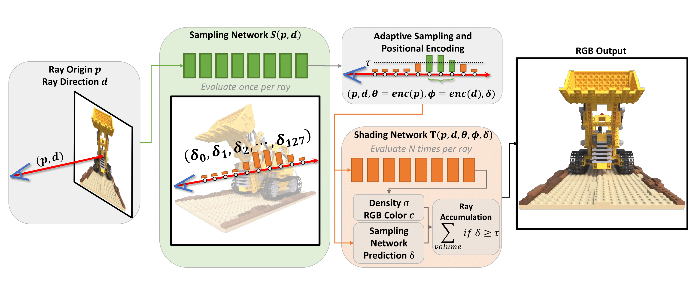

# AdaNeRF: Adaptive Sampling for Real-time Rendering of Neural Radiance Fields



### :warning: [Project Page]() | [Video]() | [Presentation]() | [Paper]() | [Data]()

### Licensing
The majority of this project is licensed under CC-BY-NC, except for adapted third-party code, which is available under separate license terms:

* [nerf](https://github.com/bmild/nerf) is licensed under the MIT license
* [nerf-pytorch](https://github.com/yenchenlin/nerf-pytorch) is licensed under the MIT license
* [FLIP](https://github.com/NVlabs/flip) is licensed under the BSD-3 license
* [Python-IW-SSIM](https://github.com/Jack-guo-xy/Python-IW-SSIM) is licensed under the BSD license
* [DONeRF](https://github.com/facebookresearch/DONERF) is licensed under the CC-BY-NC license.


### General
This repository contains the source code for the paper "AdaNeRF: Adaptive Sampling for Real-time Rendering of Neural Radiance Fields", as well as a customized/partial port of the [nerf-pytorch](https://github.com/yenchenlin/nerf-pytorch) codebase by Yen-Chen Lin.

The codebase has been tested on Ubuntu 20.04 and Arch using an RTX3090 with 24 GB of VRAM, and should also work on other distributions.

### Repo Structure
`configs/` contains example configuration files to get started with experiments.

`src/` contains the pytorch training/inference framework that handles training of all supported network types.

`requirements.txt` lists the required python packages for the code base. We recommend conda to setup the development environment. Note that PyTorch 1.8 is the minimum working version due to earlier versions having issues with the parallel dataloaders.


### Datasets
We used the umodified DONeRF dataset in our project. More information on the dataset and the dataset itself can be found on the official DONeRF repository [here](https://github.com/facebookresearch/DONERF).

The standard LLFF dataset can be modified to work with our codebase with the included `convert_llff.py` script. The (unconverted) LLFF dataset can be found [here](https://www.matthewtancik.com/nerf).

### Training / Example Commands
To train a network with a given configuration file, you can adapt the following examplary command, executed from within the `src/` directory. All things in angle brackets `<EXAMPLE>` need to be replaced by specific values depending on your use case, please refer to `src/util/config.py` for all valid configutation options. All configuration options can also be supplied via the command line.

The following basic command performs dense training of an AdaNeRF network on the given dataset. The dense training uses 128 samples in the shading network.

```bash
python train.py -c ../configs/dense_training.ini --data <PATH_TO_DATASET_DIRECTORY> --logDir <PATH_TO_OUTPUT_DIRECTORY> 
```

A specific CUDA device can be chosen for training by supplying the `--device` argument:

```bash
python train.py -c ../configs/dense_training.ini --data <PATH_TO_DATASET_DIRECTORY> --logDir <PATH_TO_OUTPUT_DIRECTORY> --device <DEVICE_ID>
```

As the weight for our adaptive sampling network needs to be tuned per scene, it can be supplied to the network with the `--lossWeights` argument:

```bash
python train.py -c ../configs/dense_training.ini --data <PATH_TO_DATASET_DIRECTORY> --logDir <PATH_TO_OUTPUT_DIRECTORY> --device <DEVICE_ID> --lossWeights <LOSS_WEIGHT_PER_SCENE> --lossWeights 1.0
```

(Important to note here is that we pass a second lossWeights with a value of 1.0 for our shading network.)

By default, our dataloader loads images on-demand by using 8 parallel workers. To store all data on the GPU at all times (for faster training), supply the `--storeFullData` argument:

```bash
python train.py -c ../configs/dense_training.ini --data <PATH_TO_DATASET_DIRECTORY> --logDir <PATH_TO_OUTPUT_DIRECTORY> --device <DEVICE_ID> --lossWeights <LOSS_WEIGHT_PER_SCENE> --lossWeights 1.0 --storeFullData
```

(Due to both networks being trained simultaneously, it may not be possible to store the image data on the GPU as well, unless a high-end GPU is utilized.)

To perform the fine training of the above densely trained AdaNeRF network, the following command can be used:

```bash
python train.py -c ../configs/fine_training.ini --data <PATH_TO_DATASET_DIRECTORY> --logDir <PATH_TO_OUTPUT_DIRECTORY> --lossWeights <LOSS_WEIGHT_PER_SCENE> --lossWeights 1.0 --preTrained <PATH_TO_DENSE_NETWORK> --preTrained <PATH_TO_DENSE_NETWORK>
```

To change the threshold used for adaptive sampling, simply supply the `adaptiveSamplingThreshold` argument for fine training:

```bash
python train.py -c ../configs/fine_training.ini --data <PATH_TO_DATASET_DIRECTORY> --logDir <PATH_TO_OUTPUT_DIRECTORY> --lossWeights <LOSS_WEIGHT_PER_SCENE> --lossWeights 1.0 --preTrained <PATH_TO_DENSE_NETWORK> --preTrained <PATH_TO_DENSE_NETWORK> --adaptiveSamplingThreshold <THRESHOLD>
```

The complete example commands to perform dense as well as fine training for an AdaNeRF network with 8 samples per ray on the classroom dataset using the CUDA Device 0, a loss weight of 0.01, adaptive sampling threshold of 0.2, and storing the outputs in /data/output_results/ could look like this:

```bash
python train.py -c ../configs/dense_training.ini --data /data/classroom/ --logDir /data/output_results/  --device 0 --lossWeights 0.01 --lossWeights 1.0
python train.py -c ../configs/fine_training.ini --data /data/classroom/ --logDir /data/output_results/ --device 0 --lossWeights 0.01 --lossWeights 1.0 --preTrained /data/output_results/ --preTrained /data/output_results/ --adaptiveSamplingThreshold 0.2 --numRayMarchSamples 8 --numRayMarchSamples 8
```

(Important to note here is that we pass numRayMarchSamples and preTrained twice - the first value is actually ignored for numRayMarchSamples since the first network in this particular config file does not use raymarching, but certain config options, like preTrained, are specified per network.)

#### Memory
As AdaNeRF trains both the adaptive sampling network and the shading network concurrently, the memory requirements during the dense training are very high.

To allow training on lower-end GPUs, the number of images and samples per batch can be reduced.

This can be done by modifying the `batchImages` and `samples` parameters.

The supplied config files use `2` and `2048` respectively, which runs on an RTX3090.

Depending on the used hardware, the parameters may have to be reduced to `1` and `1024` respectively.

### Testing / Example Commands

By default, the framework produces rendered output image every `epochsRender` iterations, and validates on the validation set every `epochsValidate` iterations.

Videos can be generated by supplying json paths for the poses, and `epochsVideo` will produce a video from a predefined path at regular intervals. 

For running just an inference pass for all the test images and for a given video path, you can use `src/test.py`. 

This also takes the same arguments and configuration files as `src/train.py` does, so following the example for the training command, you can use `src/test.py` as follows:

```bash
python test.py -c ../configs/fine_training.ini --data /data/classroom/ --logDir /data/output_results/ --device 0 --lossWeights 0.01 --lossWeights 1.0 --adaptiveSamplingThreshold 0.2 --numRayMarchSamples 8 --numRayMarchSamples 8 --camPath cam_path_rotate --outputVideoName cam_path_rotate --videoFrames 300
```

(In this case no preTrained arguments are necessary, as the network should already be trained and does not have to load the model parameters of the densely trained network.)

### Evaluation

To generate quantitative results (and also output images/videos/diffs similar to what `src/test.py` can also do), you can use `src/evaluate.py`. 
To directly evaluate after training, supply the `--performEvaluation` flag to any training command.
This script only requires the `--data` and `--logDir` options to locate the results of the training procedure, and has some additional evaluation-specific options that can be inspected at the top of `def main()` (such as being able to skip certain evaluation procedures or only evaluate specific things).

`src/evaluate.py` performs the evaluation on all subdirectories (if it hasn't done so already), so you only need to run this script once for a specific dataset and all containing results are evaluated sequentially.

To aggregate the resulting outputs (MSE, SSIM, FLIP, FLOP / Pixel, Number of Parameters), you can use `src/comparison.py` to generate a resulting `.csv` file.

### Citation

If you find this repository useful in any way or use/modify AdaNeRF in your research, please consider citing our paper:

:warning:

```bibtex
TODO
```


